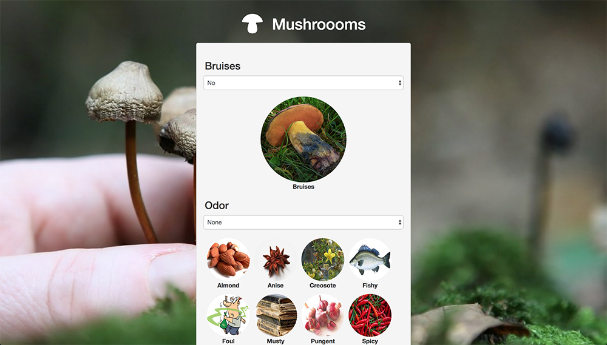
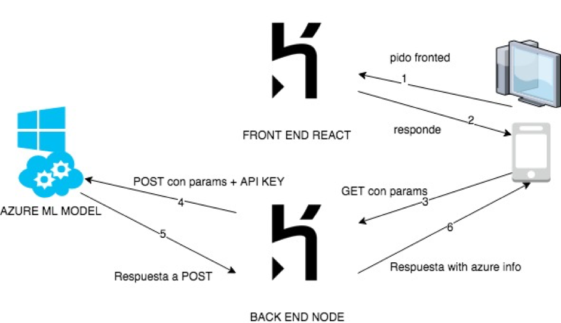
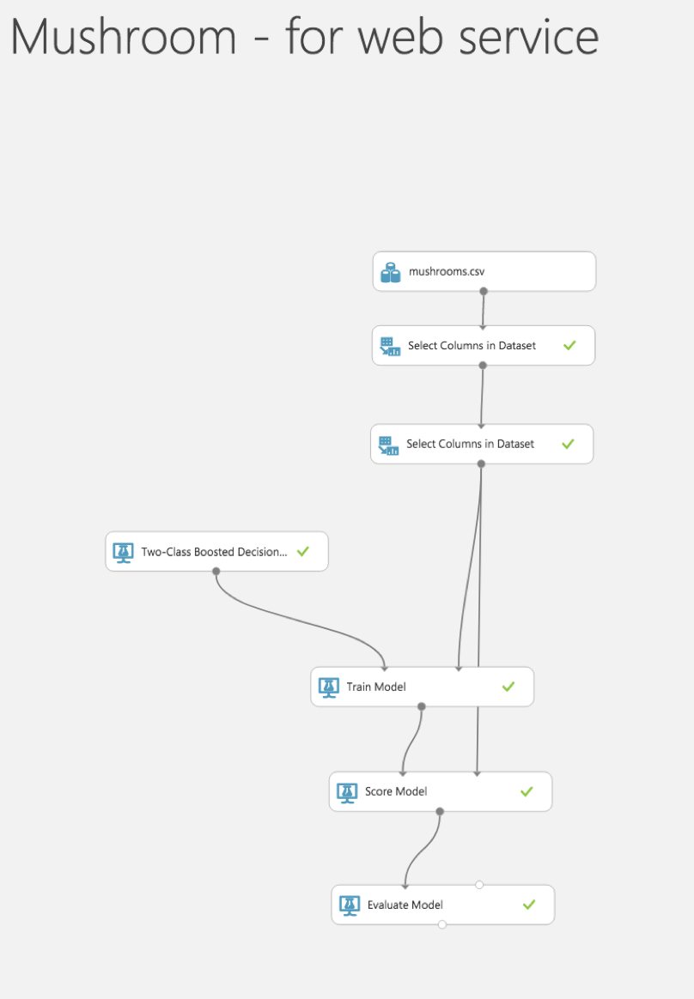
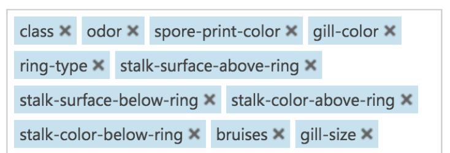
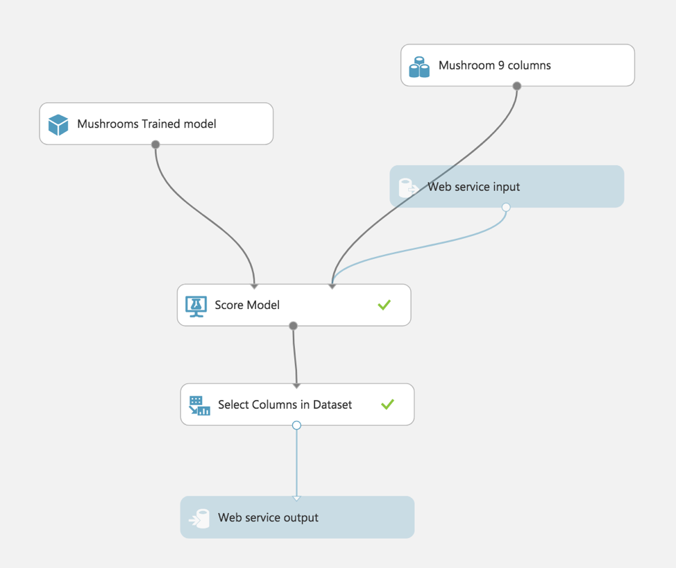

# User interface of Azure ML process

The purpose of this project is to create a user-friendly interface base on React, to predict if a mushroom is poisonous or edible,  [DATA](https://www.kaggle.com/uciml/mushroom-classification).

This project use an API created with node, which communicate with Azure ML API. The reason of these architecture is because Azure ML API doesn’t provide CORS for another domain different than Azure.

## Preview

## Architecture

## Azure ML process

### Selected attributes

## Azure ML API

This project is base on react boilerplate.
